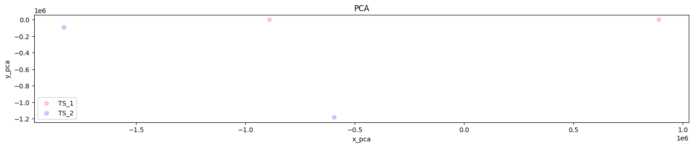
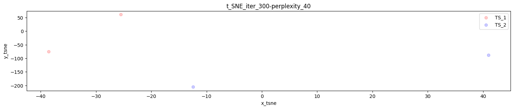
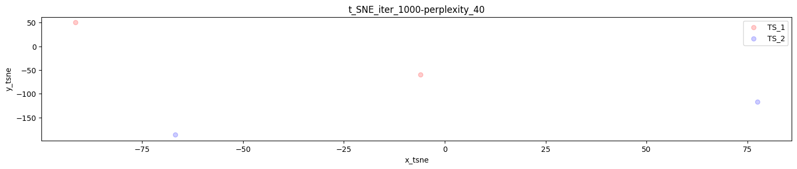
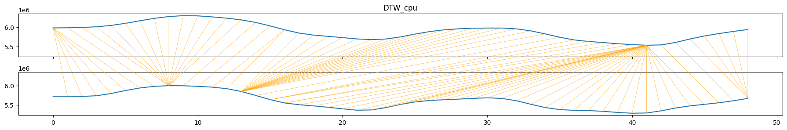

[](https://github.com/alejandrofdez-us/TimeSeriesEvaluationFramework/releases)
[](https://www.python.org/downloads/release/python-390/)
[](https://github.com/alejandrofdez-us/TimeSeriesEvaluationFramework/commits/main)


# Time Series Evaluation Framework

## Table of Contents

- [Project Description](#project-description)
- [Installation](#installation)
- [Usage](#usage)
- [License](#license)

## Project Description

Time Series Evaluation Framework is an open-source project designed to facilitate the evaluation and comparison of multivariate time series data. It provides a comprehensive toolkit for analyzing, visualizing, and reporting multiple metrics and figures derived from time series datasets. The framework simplifies the process of evaluating time series by offering data preprocessing, metrics computation, visualization, statistical analysis, and report generation functionalities. With its customizable features, Time Series Evaluation Framework empowers researchers and data scientists to gain insights, identify patterns, and make informed decisions based on their time series data.


It can compute the following **metrics**:

- `kl`: Kullback-Leibler divergence
- `js`: Jensen-Shannon divergence
- `ks`: Kolmogorov-Smirnov test
- `mmd`: Maximum Mean Discrepancy
- `dtw` Dynamic Time Warping
- `cc`: Difference of co-variances
- `cp`: Difference of correlations
- `hi`: Difference of histograms

and generates the following **figures**:

- `2D`: the ordinary graphical representation of the time series in a 2D figure with the time represented on the x axis and the data values on the y-axis for
  - the complete multivariate time series; and
  - a plot per column.

  Each generated figure plots both the original and the synthetically generated data to easily obtain key insights into the similarities or differences between them.
- `deltas`: the differences between the values of each column grouped by periods of time. For instance, the differences between the cpu usage every 5 minutes or every 30 minutes. These deltas can be used as a means of comparison between time series short-/mid-/long-term patterns.
.png)
.png)
.png)
- `pca`: the linear dimensionality reduction technique that aims to find the principal components of a data set by computing the linear combinations of the original characteristics that explain the most variance in the data.

- `tsne`: a tool for visualising high-dimensional data sets in a 2D or 3D graphical representation allowing the creation of a single map that reveals the structure of the data at many different scales.


- `dtw` path: In addition to the numerical similarity measure, the graphical representation of the DTW path of each column can be useful to better analyse the similarities or differences between the time series columns. Notice that there is no multivariate representation of DTW paths, only single column representations.


## Installation

To get started, follow these steps to install the Time Series Evaluation Framework:
### Step 1. Clone the repository to your local machine:
```Bash
git clone https://github.com/alejandrofdez-us/TimeSeriesEvaluationFramework
```
### Step 2. Navigate to the project directory:
```Bash
cd TimeSeriesEvaluationFramework
```

### Step 3. Install the required dependencies:
```Bash
pip install -r requirements.txt
```

## Usage
Users must provide `.csv` files containing multivariate time series by using the arguments `--time_series_1_filename` or `-ts1` and `--time_series_2_path` or `-ts2_path`.

- `-ts1` should point to a single `csv` filename.
- `ts2_path` can point to another single `csv` filename or a directory that contains multiple `csv` files to be compared with `-ts1` file.

Constraints:

- `-ts1` may be a time series that includes more rows than `-ts2_path` files.
- all `-ts2_path` files should have the same number of rows.
- `-ts1` file and `-ts2_path` files should have the same number of columns.


If `-ts1` file include more rows than `-ts2_path` files, the fist time series will be divided in windows in order to pick the most similar window per each `ts2_path` file, and therefore compute metrics and figures between the selected window and each `-ts2_path` time series.

`DTW` is the default metric when it comes to picking each window, any other metric is also available for this purpose using the --window_selection_metric argument.

Examples of usage are shown below:

- Comparing two time series using DTW metric and figure parameters:
```Bash
python main.py --time_series_1_filename data/example_1.csv --time_series_2_path experiments/mini_example_1.csv --metrics dtw --figures dtw
```

- Comparison between a time series and all time series within a directory:
```Bash
python main.py --time_series_1_filename data/example_1.csv --time_series_2_path experiments --metrics dtw --figures dtw
```

- Comparison using every metric and figure available:
```Bash
python main.py -ts1 data/example_1.csv -ts2 experiments --metrics cc cp dtw hi js kl ks mmd --figures deltas dtw evolution pca tsne
```

- Comparison using filenames whose first rows are used as headers (all filenames must contain the same header):
```Bash
python main.py -ts1 data/example_1.csv -ts2 experiments -m dtw -f dtw --header
```

- Comparison between time series specifying the frequency in seconds in which samples were taken:
```Bash
python main.py -ts1 data/example_1.csv -ts2 experiments -m dtw -f dtw --timestamp_frequency_seconds 60
```

- Comparison between time series specifying the stride that determines the step or distance by which a fixed-size window moves over the first time series:
```Bash
python main.py -ts1 data/example_1.csv -ts2 experiments -m dtw -f dtw --stride 5
```

- Comparison between time series specifying the window selection metric to be used when selecting the best windows in the first time series:
```Bash
python main.py -ts1 data/example_1.csv -ts2 experiments -m dtw -f dtw --window_selection_metric js
```

- Using our sample time series to compute every single metric and figure:
```Bash
python main.py -ts1 data/sample_1.csv -ts2 experiments -head -m cc cp dtw hi js kl ks mmd -f deltas dtw evolution pca tsne -w_select_met cc -ts_freq_secs 60 -strd 5
```

Every output will be found in the `results` directory.

Additionally, users may implement their own metric or figure classes an include them within the `metrics` or `plots` directory. To ensure compatibility with our framework, they have to inherit from the base classes (`Metric` and `Plot`) and include their implemented classes as options in the argument parser found in `main.py`.

This allows the framework to dynamically recognize and utilize these custom classes based on user input. By including them in the argument parser, users can easily select their custom metrics or plots when running the framework, ensuring that their classes are properly integrated and applied during the time series evaluation process.

## License

Time Series Evaluation Framework is free and open-source software licensed under the [MIT license](LICENSE).